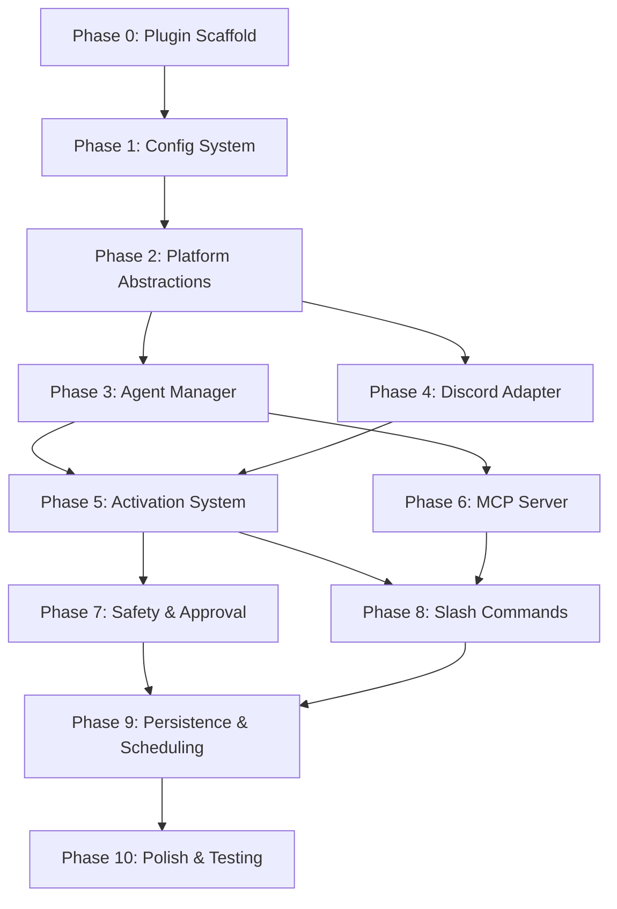

# 📋 `ganymede` — Runbook

> Living ledger for implementation. Update status markers as work progresses.
> 
> **Last updated**: Phase 0 not yet started (incorporating Local HTTP IPC, Fallbacks, Routing Locks, and Agent-initiated Scheduling).

---

## Legend

| Symbol | Meaning |
|---|---|
| ⬜ | Not started |
| 🔄 | In progress |
| ✅ | Complete |
| ⚠️ | Blocked / needs input |
| 🔴 | Risk callout — see pitfalls report |

---

## Dependency Graph



---

## Phase 0 — Plugin Scaffold

> Establish the Antigravity plugin directory structure, manifest files, and installable Python package.

### Steps

#### ✅ 0.1 — Create plugin directory structure

Create the canonical Antigravity plugin layout at the project root. This will be installable/symlinked into `~/.gemini/antigravity-cli/plugins/ganymede/`.

```
ganymede/
├── plugin.json
├── mcp_config.json
├── sidecars/
│   └── discord-bridge/
│       └── sidecar.json
├── skills/
│   └── discord/
│       └── SKILL.md
├── rules/
│   └── discord-context.md
├── src/
│   └── ganymede/
│       ├── __init__.py
│       └── __main__.py
├── config/
│   └── default.yaml
├── pyproject.toml
├── README.md
├── .env.example
└── .gitignore
```

**Files to create**: All directories and placeholder files above.

---

#### ✅ 0.2 — Write `plugin.json`

```json
{
  "$schema": "https://antigravity.google/schemas/v1/plugin.json",
  "name": "ganymede",
  "description": "Discord communications and productivity toolkit for Antigravity agents"
}
```

**File**: `plugin.json`

---

#### ✅ 0.3 — Write `sidecar.json` for the Discord bridge

```json
{
  "command": "python3",
  "args": ["-m", "ganymede"],
  "restart_policy": "on-failure",
  "description": "Discord communications bridge — receives messages, manages agent sessions, streams responses"
}
```

**File**: `sidecars/discord-bridge/sidecar.json`

---

#### ✅ 0.4 — Write `mcp_config.json` (stub)

Registers our Discord MCP tools server. The actual server code comes in Phase 6.

```json
{
  "mcpServers": {
    "discord": {
      "command": "python3",
      "args": ["-m", "ganymede.mcp_server"],
      "env": {
        "DISCORD_TOKEN": "${DISCORD_TOKEN}"
      }
    }
  }
}
```

**File**: `mcp_config.json`

> 🔴 **Pitfall**: MCP server must use stderr for ALL logging. No stdout prints. Enforce this with a custom logging handler from the start.

---

#### ✅ 0.5 — Write `SKILL.md` for Discord tools

Agent-facing instructions that teach the agent how and when to use Discord tools.

**File**: `skills/discord/SKILL.md`  
**Content**: Frontmatter (name, description) + markdown instructions explaining each Discord tool, when to use them, and examples.

---

#### ✅ 0.6 — Write `rules/discord-context.md`

Behavioral rules for agents operating in a Discord context:
- Keep responses under 2000 chars when possible
- Use Discord markdown (not generic markdown)
- Don't produce raw HTML
- Be concise — Discord isn't an IDE

**File**: `rules/discord-context.md`

---

#### ✅ 0.7 — Write `pyproject.toml`

```toml
[project]
name = "ganymede"
version = "0.1.0"
requires-python = ">=3.11"
dependencies = [
    "google-antigravity>=0.1.0",
    "discord.py>=2.4.0",
    "pyyaml>=6.0",
    "aiosqlite>=0.20.0",
    "python-dotenv>=1.0.0",
    "structlog>=24.0.0",
    "apscheduler>=4.0.0a5",
    "mcp>=1.0.0",
    "aiohttp>=3.9.0",
]

[project.scripts]
ganymede = "ganymede.cli:main"

[build-system]
requires = ["hatchling"]
build-backend = "hatchling.build"
```

**File**: `pyproject.toml`

---

#### ✅ 0.8 — Write `.env.example`, `.gitignore`, skeleton `__init__.py` / `__main__.py`

- `.env.example`: `DISCORD_TOKEN=`, `AGY_DISCORD_LOG_LEVEL=INFO`
- `.gitignore`: Python, `.env`, `*.db`, `__pycache__`, `.venv`
- `__init__.py`: Version string
- `__main__.py`: `from ganymede.cli import main; main()`

**Files**: `.env.example`, `.gitignore`, `src/ganymede/__init__.py`, `src/ganymede/__main__.py`

---

#### ✅ 0.9 — Verify installable

Run `pip install -e .` and confirm `ganymede --help` prints usage (will error on missing `cli.py` — that's fine, just confirm the entry point resolves).

**Acceptance**: `pip install -e .` succeeds. Import `ganymede` works.

---

## Phase 1 — Config System

> Layered configuration: defaults → YAML → env vars → CLI flags. Integrated with Antigravity's data directory conventions.

### Steps

#### ✅ 1.1 — Define config dataclasses

```python
@dataclass
class DiscordConfig:
    token: str
    allowed_guilds: list[str]

@dataclass
class AgentConfig:
    system_instructions: str
    workspace: str
    capabilities: CapabilitiesConfig
    idle_timeout_minutes: int = 60
    max_contexts: int = 20

@dataclass
class QuotaConfig:
    max_tokens_per_context_per_hour: int = 50_000
    max_tokens_global_per_hour: int = 200_000
    alert_threshold_pct: int = 80

@dataclass
class ActivationConfig:
    default_mode: str = "mention"  # "mention" | "inference" | "always"
    respond_to_bots: bool = False
    trigger_patterns: list[str] = field(default_factory=list)
    per_channel: dict[str, str] = field(default_factory=dict)

@dataclass
class AppConfig:
    discord: DiscordConfig
    agent: AgentConfig
    quota: QuotaConfig
    activation: ActivationConfig
    data_dir: str  # Resolved from environment
    log_level: str = "INFO"
```

**File**: `src/ganymede/config.py`

> 🔴 **Pitfall**: `data_dir` must default to `$ANTIGRAVITY_EXECUTABLE_DATA_DIR` when running as a sidecar. Fall back to `~/.gemini/antigravity-cli/plugins/ganymede/data/` (or project root data folder) for local testing and development.

---

#### ✅ 1.2 — Write `config/default.yaml`

All default values. See design doc v2 for full schema.

**File**: `config/default.yaml`

---

#### ✅ 1.3 — Implement `load_config()` with layered merging

Priority: CLI flags > env vars > user YAML > defaults.

- Resolve `$ANTIGRAVITY_EXECUTABLE_DATA_DIR` with a local fallback directory for test environments.
- Expand `~` in paths
- Validate required fields (token must be set)

**File**: `src/ganymede/config.py`  
**Acceptance**: Unit test loads config from YAML, overrides with env var, confirms precedence.

---

#### ✅ 1.4 — Write `cli.py` entry point

```python
def main():
    parser = argparse.ArgumentParser(prog="ganymede")
    parser.add_argument("--config", default=None)
    parser.add_argument("--workspace", default=None)
    parser.add_argument("--log-level", default=None)
    args = parser.parse_args()
    config = load_config(args)
    asyncio.run(run(config))
```

**File**: `src/ganymede/cli.py`  
**Acceptance**: `ganymede --help` prints usage. `ganymede --config path/to/config.yaml` loads config.

---

## Phase 2 — Platform Abstractions

> Define the protocols that decouple transport (Discord/WhatsApp) from core logic, and handle concurrency locks.

### Steps

#### ✅ 2.1 — Define `ContextKey`

```python
@dataclass(frozen=True)
class ContextKey:
    platform: str
    channel_id: str
    thread_id: str | None = None
```

**File**: `src/ganymede/core/__init__.py`

---

#### ✅ 2.2 — Define `PlatformMessage` model

Normalized inbound message from any platform. Fields: `context`, `author_id`, `author_name`, `content`, `is_bot`, `mentions_us`, `attachments`, `reply_to`, `raw` (platform-specific original).

**File**: `src/ganymede/core/models.py`

---

#### ✅ 2.3 — Define `PlatformAdapter` protocol

Methods: `start()`, `stop()`, `send_response()`, `send_streaming_start()`, `edit_streaming()`, `send_streaming_end()`, `on_message` callback registration.

**File**: `src/ganymede/platforms/base.py`

---

#### ✅ 2.4 — Define `Formatter` protocol

Methods: `format_text()`, `format_code_block()`, `format_error()`, `format_task_status()`, `format_approval_request()`, `split_message()`, property `max_message_length`.

**File**: `src/ganymede/formatting/base.py`

---

#### ✅ 2.5 — Define `Router`

Takes a `PlatformMessage`, runs it through the activation strategy, and dispatches to the agent manager.

```python
class Router:
    def __init__(self, config, agent_manager):
        self.config = config
        self.agent_manager = agent_manager
        self._locks: dict[ContextKey, asyncio.Lock] = {}

    async def handle_message(self, message: PlatformMessage) -> None:
        if not self.activation.should_respond(message, self.config):
            return
        
        # Ensure per-context serialization to prevent overlapping chats or race conditions
        lock = self._locks.setdefault(message.context, asyncio.Lock())
        async with lock:
            agent = await self.agent_manager.get_or_create(message.context)
            response = await agent.chat(message.content)
            await self.stream_response(message.context, response)
```

**File**: `src/ganymede/core/router.py`  
**Acceptance**: Router instantiates with mock adapter/agent. Mutex lock serializes incoming prompts per context.

---

## Phase 3 — Agent Manager + Quota Tracking

> SDK integration. One agent per context key. Idle reaping. Token budgeting.

### Steps

#### ✅ 3.1 — Implement `AgentManager`

Core lifecycle: `get_or_create(context_key)`, `destroy(context_key)`, `destroy_all()`.

- Spawns `Agent(config)` per context key
- Stores in `dict[ContextKey, ManagedAgent]`
- Caps at `config.agent.max_contexts`
- On cap hit: reap oldest idle agent, or reject with "too many active contexts"

**File**: `src/ganymede/core/agent_manager.py`

> 🔴 **Pitfall**: `async with Agent()` — if our process crashes, agent subprocesses orphan. Register `atexit` and signal handlers (`SIGTERM`, `SIGINT`) to clean up.

---

#### ✅ 3.2 — Implement idle reaping

Background `asyncio.Task` that runs every 60s:
- Check `last_active` timestamp for each managed agent
- If `now - last_active > config.agent.idle_timeout_minutes`: destroy the agent
- Log reaping events

**File**: `src/ganymede/core/agent_manager.py`

---

#### ✅ 3.3 — Implement `QuotaTracker`

```python
class QuotaTracker:
    """Rolling-window token budget tracker."""
    
    async def record_usage(self, context: ContextKey, tokens: int) -> None: ...
    async def check_budget(self, context: ContextKey) -> BudgetStatus: ...
    async def get_usage_summary(self) -> dict: ...
```

- Per-context hourly budget
- Global hourly budget
- Alert when usage exceeds threshold (posts warning to Discord channel)
- Hard reject when budget exhausted

**File**: `src/ganymede/core/quota.py`

> 🔴 **Pitfall**: This is the #1 operational risk. A busy Discord server burns through shared quota and locks the user out of their IDE. Non-optional.

---

#### ✅ 3.4 — Wire quota tracking into agent chat flow

Intercept `agent.chat()` responses, count tokens from the stream, feed into `QuotaTracker`. On budget exhaustion, catch the error and notify the Discord channel.

**File**: `src/ganymede/core/agent_manager.py`

> 🔴 **Pitfall**: Agent hard-stops on quota hit. No graceful shutdown. We must catch this exception and send a "⚠️ Quota exhausted" message to Discord.

---

#### ✅ 3.5 — Standalone agent integration test

Script that:
1. Loads config
2. Creates `AgentManager`
3. Spawns an agent for a fake context key
4. Sends a prompt, streams the response to stdout
5. Destroys the agent

**Acceptance**: Tokens stream to stdout. Agent spawns and cleans up without orphans.

---

## Phase 4 — Discord Adapter

> Connect to Discord, normalize messages, stream responses with live-editing.

### Steps

#### ✅ 4.1 — Implement `DiscordAdapter` (bot lifecycle)

Extends `discord.Client`. Handles:
- `on_ready`: Log connection, sync slash commands
- `on_message`: Normalize to `PlatformMessage`, dispatch to router callback
- Thread awareness: detect `thread_id` from message context
- `Intents`: `message_content`, `guilds`, `guild_messages`

**File**: `src/ganymede/platforms/discord/adapter.py`

---

#### ✅ 4.2 — Implement `DiscordFormatter`

Discord-specific rendering:
- `format_text()`: Convert generic markdown to Discord markdown
- `format_code_block()`: Ensure proper ` ``` ` fencing
- `split_message()`: Split at 2000 chars on code block / paragraph boundaries
- `format_error()`: Red embed with error details
- `max_message_length`: 2000

**File**: `src/ganymede/platforms/discord/formatter.py`

---

#### ✅ 4.3 — Implement `DiscordStreamer`

Rate-limited message editor for streaming agent responses:

```python
class DiscordStreamer:
    EDIT_INTERVAL = 1.5  # seconds
    
    async def start(self, channel) -> discord.Message:
        """Send initial '⏳ Thinking...' message."""
    
    async def push_tokens(self, tokens: str) -> None:
        """Buffer tokens, edit message on interval."""
    
    async def finish(self, metadata: dict) -> None:
        """Final edit, add ✅ reaction, footer with stats."""
```

- Handles message splitting when content exceeds 2000 chars
- Properly closes open code blocks on each intermediate edit
- Respects Discord's ~2 edits/sec rate limit

**File**: `src/ganymede/platforms/discord/streamer.py`

> 🔴 **Pitfall**: Open code blocks must be closed on every intermediate edit, or Discord renders garbled markdown. Track open fence state.

---

#### ✅ 4.4 — Wire adapter into CLI entry point

```python
async def run(config: AppConfig):
    agent_manager = AgentManager(config)
    router = Router(config, agent_manager)
    adapter = DiscordAdapter(config, router)
    await adapter.start(config.discord.token)
```

**File**: `src/ganymede/cli.py`  
**Acceptance**: Bot comes online in Discord, responds to mentions with a streamed agent response.

---

## Phase 5 — Activation System

> Configurable per-channel response triggers. Bot-to-bot communication toggle.

### Steps

#### ✅ 5.1 — Implement activation strategies

```python
class MentionActivation:    # Respond only when @mentioned
class InferenceActivation:  # Respond on mention OR pattern match
class AlwaysOnActivation:   # Respond to every message
```

**File**: `src/ganymede/core/activation.py`

---

#### ✅ 5.2 — Implement bot-to-bot filtering

Check `message.is_bot` against `config.activation.respond_to_bots`. When enabled, add safeguards:
- Don't respond to our own messages (prevent self-loops)
- Rate-limit bot-to-bot exchanges (max 5 turns per minute per context)

**File**: `src/ganymede/core/activation.py`

---

#### ✅ 5.3 — Wire per-channel activation overrides

Look up `config.activation.per_channel[channel_id]` to resolve the strategy. Fall back to `config.activation.default_mode`.

**File**: `src/ganymede/core/activation.py`  
**Acceptance**: Bot ignores messages in a mention-only channel when not mentioned. Responds to everything in an always-on channel.

---

## Phase 6 — MCP Server (Discord Tools for Agent)

> Expose Discord capabilities to the agent via a stdio MCP server. The agent can read channels, post messages, query threads.

### Steps

#### ✅ 6.1 — Set up MCP server skeleton

Use the `mcp` Python SDK and FastMCP. Stdio transport. **All logging to stderr.**

```python
import sys, logging
logging.basicConfig(stream=sys.stderr)  # CRITICAL: never use stdout
```

**File**: `src/ganymede/mcp_server/__init__.py`, `src/ganymede/mcp_server/__main__.py`

> 🔴 **Pitfall**: A single `print()` to stdout will corrupt the JSON-RPC protocol and crash the integration. Enforce stderr-only from line 1.

---

#### ✅ 6.2 — Implement Local HTTP IPC Server

Instead of polling SQLite, the long-running Discord sidecar bot hosts a local HTTP server (using `aiohttp.web`) on a dynamic port.
- Writes the chosen port to `$ANTIGRAVITY_EXECUTABLE_DATA_DIR/rpc_port.txt` on startup.
- Exposes endpoints: `/api/channel/history`, `/api/channel/info`, `/api/message/post`, `/api/thread/create`, `/api/schedule/cron`.

**File**: `src/ganymede/platforms/discord/ipc_server.py`  
**Acceptance**: Bot launches, writes a port file. Running curl against the port returns JSON.

---

#### ✅ 6.3 — Implement Discord tools in MCP

Each tool is exposed via MCP. Instead of contacting Discord directly, the MCP server reads the port file and issues synchronous HTTP requests to the sidecar's IPC server.

Exposed tools:
- `read_channel_history(channel_id: str, limit: int)`
- `read_thread_messages(thread_id: str, limit: int)`
- `get_channel_info(channel_id: str)`
- `list_threads(channel_id: str)`
- `post_to_channel(channel_id: str, content: str)`
- `create_thread(channel_id: str, name: str, content: str)`
- `schedule_cron(cron_expr: str, prompt: str, channel_id: str)` (Leveraged by the agent to dynamically set a recurring task/cron job inside our system)

**File**: `src/ganymede/mcp_server/tools.py`

---

#### ✅ 6.4 — Implement sidecar-side IPC handler

The sidecar bot parses the HTTP requests, executes the actions (e.g., posting to Discord via `discord.py` Client, storing schedules in SQLite, registering jobs in APScheduler), and returns the results.

**File**: `src/ganymede/platforms/discord/ipc_handlers.py` (Done inline inside `ipc_server.py`)

---

#### ✅ 6.5 — Test MCP server with MCP Inspector

Use the official MCP Inspector tool to verify:
- Server starts without stdout corruption
- `tools/list` returns all tools with correct schemas
- `tools/call` resolves tool executions via localhost IPC

**Acceptance**: MCP Inspector shows all tools. Calling `read_channel_history` returns data fetched from Discord via the sidecar.

---

## Phase 7 — Safety & Approval Hooks

> Deny-by-default policies. Discord-based approval for dangerous operations.

### Steps

#### ✅ 7.1 — Define default safety policies

```python
policies = [
    deny("*"),
    allow("view_file"),
    allow("grep_search"),
    allow("list_dir"),
    allow("search_web"),
    allow("read_url_content"),
    # Everything else requires approval
]
```

**File**: `src/ganymede/core/safety.py`

---

#### ✅ 7.2 — Implement Discord-based Decide hook

When the agent tries to call a restricted tool (e.g., `run_command`, `write_to_file`):

1. Post an approval embed to the channel: "🔒 Agent wants to run: `run_command` with args: `...`"
2. Send a `discord.ui.View` with **Approve** (Green) and **Deny** (Red) buttons.
3. Block execution using `await view.wait()` inside the agent's Decide hook.
4. Verify user roles: only users with allowed admin roles can interact (non-admins receive an ephemeral error).
5. If Approved: return `True` to allow tool execution.
6. If Denied or timed out (60s): disable buttons, update embed inline with audit results, and return `False`.

```python
class DiscordApprovalHook:
    """Decide hook that uses Discord button views for tool execution approval."""
    async def decide(self, tool_call: ToolCall, context: AgentContext) -> bool:
        ...
```

**File**: `src/ganymede/core/safety.py`

> 🔴 **Pitfall**: `ask_user()` from the SDK assumes a terminal. This is our replacement. It must be robust — timeouts, non-admin click rejection, and inline message state updates.

---

#### ✅ 7.3 — Implement Inspect hook for audit logging

Log every tool call (name, args, result, timestamp, context key) to SQLite.

**File**: `src/ganymede/core/safety.py`  
**Acceptance**: After an agent session, the `tool_calls` table has entries for every tool invocation.

---

#### ✅ 7.4 — Wire safety policies into AgentManager

When creating an `Agent`, pass the policies and hooks into the config.

**File**: `src/ganymede/core/agent_manager.py`  
**Acceptance**: Agent with deny-by-default can `view_file` but gets blocked on `run_command` (with approval embed posted to Discord).

---

## Phase 8 — Slash Commands

> Discord application commands for explicit agent interaction.

### Steps

#### ✅ 8.1 — Register command tree

```python
tree = app_commands.CommandTree(client)

@tree.command(name="ask")
@tree.command(name="task")
@tree.command(name="status")
@tree.command(name="session")  # Subcommands: reset, info
@tree.command(name="schedule") # cron + prompt
@tree.command(name="config")   # Subcommands: capabilities, quota
@tree.command(name="help")
```

**File**: `src/ganymede/platforms/discord/commands.py`

---

#### ✅ 8.2 — Implement `/ask <prompt>`

Deferred response. Sends prompt to agent, streams response back via `DiscordStreamer`.
Option: `ephemeral` (bool) — if true, response is only visible to the invoker.

---

#### ✅ 8.3 — Implement `/task <description>`

Starts a background task. Returns immediately with task ID. On completion, posts result to channel + DMs the invoker.

---

#### ✅ 8.4 — Implement `/status [task_id]`

Lists running tasks or shows detail for a specific task.

---

#### ✅ 8.5 — Implement `/session reset` and `/session info`

- `reset`: Destroy the agent for the current context, wipe conversation history
- `info`: Show session uptime, token usage, active capabilities

---

#### ✅ 8.6 — Implement `/schedule <cron> <prompt>`

Create a recurring scheduled prompt. Validate cron expression. Store in SQLite.

---

#### ✅ 8.7 — Implement `/config capabilities` (admin-gated)

View and toggle agent capabilities (write_tools, run_commands). Requires admin role.

**File**: `src/ganymede/platforms/discord/commands.py`  
**Acceptance**: All 7 commands registered and functional. `/ask "what is 2+2"` returns a streamed response.

---

## Phase 9 — Persistence & Scheduling

> SQLite for conversations, tasks, schedules, audit logs. APScheduler for deferred execution.

### Steps

#### ✅ 9.1 — Define SQLite schema

```sql
-- Conversations
CREATE TABLE conversations (
    id INTEGER PRIMARY KEY,
    context_platform TEXT NOT NULL,
    context_channel TEXT NOT NULL,
    context_thread TEXT,
    author_id TEXT NOT NULL,
    role TEXT NOT NULL,       -- 'user' | 'assistant'
    content TEXT NOT NULL,
    tokens INTEGER,
    created_at TIMESTAMP DEFAULT CURRENT_TIMESTAMP
);

-- Scheduled jobs
CREATE TABLE schedules (
    id INTEGER PRIMARY KEY,
    context_platform TEXT NOT NULL,
    context_channel TEXT NOT NULL,
    context_thread TEXT,
    creator_id TEXT NOT NULL,
    cron_expr TEXT NOT NULL,
    prompt TEXT NOT NULL,
    active BOOLEAN DEFAULT 1,
    last_run TIMESTAMP,
    created_at TIMESTAMP DEFAULT CURRENT_TIMESTAMP
);

-- Background tasks
CREATE TABLE tasks (
    id TEXT PRIMARY KEY,      -- UUID
    context_platform TEXT NOT NULL,
    context_channel TEXT NOT NULL,
    context_thread TEXT,
    creator_id TEXT NOT NULL,
    description TEXT NOT NULL,
    status TEXT DEFAULT 'running',  -- running | completed | failed
    result TEXT,
    created_at TIMESTAMP DEFAULT CURRENT_TIMESTAMP,
    completed_at TIMESTAMP
);

-- Tool call audit log
CREATE TABLE tool_calls (
    id INTEGER PRIMARY KEY,
    context_platform TEXT NOT NULL,
    context_channel TEXT NOT NULL,
    context_thread TEXT,
    tool_name TEXT NOT NULL,
    tool_args TEXT,           -- JSON
    result TEXT,
    approved_by TEXT,         -- user ID who approved, NULL if auto-allowed
    created_at TIMESTAMP DEFAULT CURRENT_TIMESTAMP
);

-- Quota tracking
CREATE TABLE quota_usage (
    id INTEGER PRIMARY KEY,
    context_platform TEXT NOT NULL,
    context_channel TEXT NOT NULL,
    context_thread TEXT,
    tokens_used INTEGER NOT NULL,
    recorded_at TIMESTAMP DEFAULT CURRENT_TIMESTAMP
);
```

**File**: `src/ganymede/core/db.py`

> 🔴 **Pitfall**: SQLite path must be `$ANTIGRAVITY_EXECUTABLE_DATA_DIR/ganymede.db` with a dynamic local fallback path during tests.

---

#### ✅ 9.2 — Implement async DB layer

`aiosqlite` wrapper with migrations, connection pooling, and typed query methods.

**File**: `src/ganymede/core/db.py`

---

#### ✅ 9.3 — Implement APScheduler integration

- Load saved schedules from SQLite on startup
- Register cron triggers
- On fire: send prompt to agent for the associated context, post result to channel
- Persist new schedules created via `/schedule` or via `schedule_cron` tool calls.

**File**: `src/ganymede/core/scheduler.py`

---

#### ✅ 9.4 — Implement conversation history injection

Before sending a prompt to the agent, prepend relevant conversation history from SQLite. Configurable context window (default: last 10 turns).

**File**: `src/ganymede/core/router.py`  
**Acceptance**: Agent responses are contextually aware of previous turns in the channel.

---

#### ✅ 9.5 — Verify persistence across restarts

1. Start bot, have a conversation, create a schedule
2. Kill the bot
3. Restart
4. Verify: conversation history is loaded, schedule fires on time

**Acceptance**: Data survives restart. Scheduled jobs resume.

---

## Phase 10 — Polish & Testing

> Error handling, documentation, test coverage, installation workflow.

### Steps

#### ✅ 10.1 — Implement global error handling

- Catch unhandled exceptions in the router, post error embed to channel
- Catch `discord.HTTPException` for rate limits, retry with backoff
- Catch SDK quota errors, notify user
- Signal handler cleanup (`SIGTERM`, `SIGINT`)

**File**: `src/ganymede/core/router.py`, `src/ganymede/cli.py`

---

#### ✅ 10.2 — Write unit tests

| Module | Tests |
|---|---|
| `config.py` | Layered loading, env override, missing token error |
| `activation.py` | All 3 strategies, bot filtering, per-channel override |
| `quota.py` | Budget enforcement, rolling window, alert threshold |
| `formatter.py` | Message splitting, code block handling, embed construction |
| `safety.py` | Deny-by-default, allow override, approval timeout |

**Directory**: `tests/`

---

#### ✅ 10.3 — Write integration test: end-to-end flow

Mock Discord API. Simulate: message → activation → agent → stream → response.
Verify: message appears in conversation log, quota updated, tool calls audited.

---

#### ✅ 10.4 — Write `README.md`

Sections: Overview, Prerequisites, Installation (pip + plugin setup), Configuration, Discord Bot Setup, Usage, Commands Reference, Architecture, Security, Contributing.

**File**: `README.md`

---

#### ✅ 10.5 — Write setup wizard: `ganymede setup`

Interactive CLI that:
1. Prompts for Discord bot token
2. Writes `.env` file
3. Creates/symlinks plugin into `~/.gemini/antigravity-cli/plugins/ganymede/`
4. Enables the sidecar in `~/.gemini/config/config.json`
5. Syncs Discord slash commands

**File**: `src/ganymede/setup.py`

---

#### ✅ 10.6 — Final smoke test

Full end-to-end on a real Discord server:
1. Install plugin
2. Run setup wizard
3. Start sidecar
4. Send message in channel → get streamed response
5. Use `/ask`, `/task`, `/schedule`
6. Verify approval flow for `run_command`
7. Verify quota tracking
8. Kill and restart — verify persistence

---

## Deliverables Checklist

| Deliverable | Phase | Status |
|---|---|---|
| Plugin manifest (`plugin.json`) | 0 | ✅ |
| Sidecar config (`sidecar.json`) | 0 | ✅ |
| MCP config (`mcp_config.json`) | 0 | ✅ |
| Agent skill (`SKILL.md`) | 0 | ✅ |
| Agent rules (`discord-context.md`) | 0 | ✅ |
| Installable Python package | 0 | ✅ |
| Layered config system | 1 | ✅ |
| CLI entry point | 1 | ✅ |
| Platform abstractions (Protocol + ContextKey) | 2 | ✅ |
| Agent manager with lifecycle | 3 | ✅ |
| Quota tracker | 3 | ✅ |
| Discord bot (adapter + streamer + formatter) | 4 | ✅ |
| Activation strategies | 5 | ✅ |
| MCP server with 7 Discord tools | 6 | ✅ |
| Deny-by-default + approval hooks | 7 | ✅ |
| 7 slash commands | 8 | ✅ |
| SQLite persistence layer | 9 | ✅ |
| APScheduler integration | 9 | ✅ |
| Error handling + signal cleanup | 10 | ✅ |
| Unit tests | 10 | ✅ |
| README + setup wizard | 10 | ✅ |
| End-to-end smoke test | 10 | ✅ |
